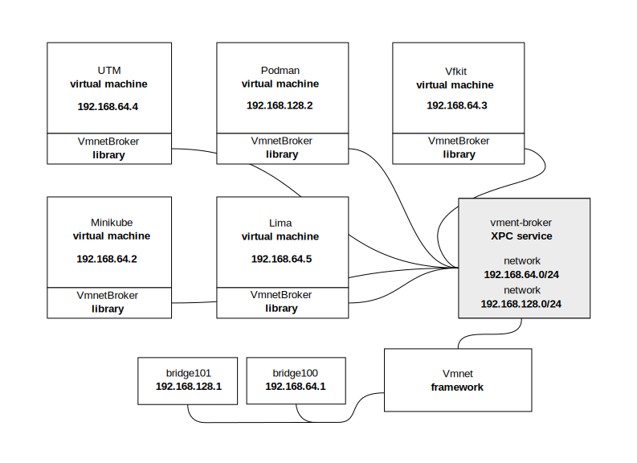

<!--
SPDX-FileCopyrightText: The vmnet-broker authors
SPDX-License-Identifier: Apache-2.0
-->

# vmnet-broker

The vmnet-broker manages shared high performance vmnet networks for all
applications using the Apple Virtualization framework.

## macOS 26: fast networks, hard to use

macOS 26 introduced native vmnet support in the Virtualization framework,
delivering dramatic performance improvements. Networks can now reach up to 80
Gbit/s, up to 6 times faster than file-handle based network. This makes vmnet
networks a compelling upgrade for all applications using the Virtualization
framework.

However, vmnet networks are bound to the process that creates them. When that
process exits, the network is destroyed, even if VMs using the network are still
running. This creates a fundamental challenge: you cannot simply create a
network in your VM launcher process because the network would disappear the
moment the launcher exits.

The solution is to build a XPC service whose sole purpose is to hold networks
alive while VMs are using them. But this approach has significant drawbacks:

- **Duplicated effort.** Every project must implement and maintain its own
  network XPC service, lifecycle management, reference counting, launchd
  integration, and error handling independently.

- **Network isolation.** VMs from different projects cannot communicate, even on
  the same machine, because each project creates separate networks.

- **System clutter.** Users end up with multiple network XPC services running,
  one for each VM tool they use.

- **Increased Friction.** Some projects require the user to start the network
  XPC service manually before running VMs, and shut it down manually when it is
  not needed.

## One broker to connect them all

vmnet-broker is a shared network XPC service that manages vmnet networks for all
applications on the system. Instead of each project building its own network
silo, they all connect to a single broker.

The broker supports default "shared" and "host" network out of the box without
any configuration. If needed, the admin can configure additional networks by
placing a network configuration file. Applications that want to use their own
networks can install network configuration files.

When your application needs a network, it calls `acquireNetwork()` with one of
the configured networks. The broker either creates a new network or returns an
existing one if other VMs are already using it. When your application exits, the
broker detects the disconnection and cleans up automatically, deleting the
network when the last VM disconnects.



### For developers

- **No XPC service code.** Acquire a network with a single function call. Client
  libraries available for C, Go, and Swift.
- **Automatic lifecycle.** Networks are reference-counted. The broker handles
  creation, sharing, and cleanup.
- **Focus on your app.** Spend time on your VM tool, not on network
  infrastructure.

### For users

- **One broker for all tools.** A single vmnet-broker replaces separate XPC
  services for each project.
- **Cross-project networking.** VMs from lima, podman, vfkit, minikube, and
  other tools can share the same network and can communicate freely.
- **Maximum performance.** All applications benefit from native vmnet
  performance in macOS 26.

## Using the broker in your application

To access the broker you can use the C, Swift or Go client libraries:

### C

```c
vmnet_broker_return_t broker_status;
xpc_object_t serialization = vmnet_broker_acquire_network("default", &broker_status);
if (serialization == NULL) {
    ERRORF("failed to start broker session: (%d) %s",
           broker_status, vmnet_broker_strerror(broker_status));
    exit(EXIT_FAILURE);
}
```

- [client](include/vmnet-broker.h)
- [example](test/test.c)

### Swift

```swift
let serialization: xpc_object_t
do {
    serialization = try VmnetBroker.acquireNetwork(named: "default")
} catch {
    logger.error("Failed to get network from broker: \(error)")
    exit(EXIT_FAILURE)
}
```

- [client](swift/Sources/VmnetBroker/client.swift)
- [example](swift/Sources/test/main.swift)

### Go

```go
serialization, err := vmnet_broker.AcquireNetwork("default")
if err != nil {
    return nil, fmt.Errorf("failed to acquire network: %w", err)
}
```

- [client](go/vmnet_broker/vmnet_broker.go)
- [example](go/cmd/test.go)

## Compatibility

macOS Tahoe 26 or later is required.

## Status

This project is work in progress. You can play with it and contribute to
the project.

## Hacking

### Dependencies

The Go test runner depends on this upstream PR:
https://github.com/Code-Hex/vz/pull/205

To build the Go test runner clone this repo:

```console
git clone https://github.com/norio-nomura/vz norio-nomura/vz
cd norio-nomura/vz
git checkout feat-add-vmnet-network-device-attachment
make
```

### Build and install

```console
make
make install
```

### Uninstall

```console
make uninstall
```

### Running the tests

To run Go and Swift tests run:

```console
make test
```

For more control run `go test` from the `go/` directory and `swift test`
from the `swift/` directory.

### Running a test VM

To create test VMs run:

```console
./create-vm vm1
./create-vm vm2
```

To run the VMs use the Go or Swift test runners:

```console
./test-go vm1
./test-swift vm2
```

> [!NOTE]
> Login with user: ubuntu password: pass

## Future work

The following are not implemented yet.

### Configuration

The broker provides the default `shared` and `host` networks using
dynamic subnet and default mask (`255.255.255.0`). The vmnet framework
assigns the next available network. This is the most reliable way,
avoiding conflicts with other programs creating networks.

To create an additional specific network, create a configuration file for
each network at `/etc/vmnet-broker.d/*.json`.

#### Using static subnet

```console
% cat /etc/vmnet-broker.d/my-testing-network.json
{
  "description": "My testing network",
  "mode": "shared",
  "subnet": "192.168.42.1"
  "mask": "255.255.255.0"
}
```

This example creates the network "192.168.42.1/24". This is useful when you want
to know the IP addresses, but may fail to create if vmnet allocated the network
to another program not using vmnet-broker.

> [!TIP]
> To avoid conflicts, all programs should use vmnet-broker.

---
See https://github.com/nirs/vmnet-broker/issues/2 for more info.

### Using with vfkit

To start a virtual machine using vfkit use the `vmnet` virtio-net device:

```
vfkit --device virtio-net,vmnet,network=shared ...
```

The virtual machine will use the "shared" builtin network. If you start multiple
instances they will use the same network and can communicate.

### Using with Minikube

To start a cluster with the vfkit driver using the vmnet "shared" network:

```
minikube start --driver vfkit --network vmnet-shared ...
```

If running on older macOS version or vmnet-broker is not installed, minikube
will fallback to using vmnet-helper.

## License

This project is licensed under the [Apache License 2.0](LICENSE).
